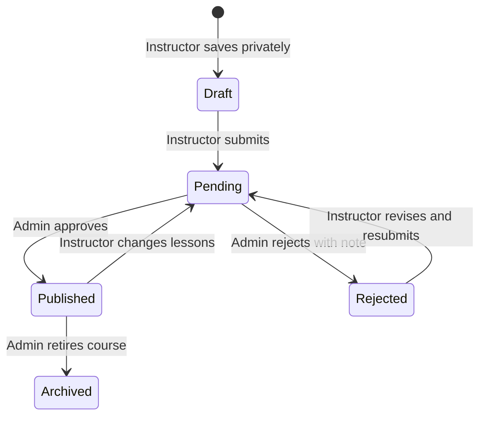

# CourseHub role and business workflows

This document describes the single-source-of-truth workflow used by the Student, Instructor, and Admin panels.

## Core data rule

Every course exists once in `courses` and receives one permanent `courses.id`. The record also stores `instructor_id`, which points to the instructor in `users.id`.

Chapters and lessons do not create copies of a course:

```text
users.id (instructor)
  -> courses.id
       -> course_sections.course_id
            -> course_lessons.section_id
```

Orders, enrollments, earnings, reviews, and change logs all point back to the same `courses.id`. The public marketplace, instructor library, admin review queue, and student learning page therefore read the same course entity with different permission rules.

## Course state workflow



| Status | Instructor | Admin | Student/public |
| --- | --- | --- | --- |
| `draft` | Visible and editable | Hidden | Hidden |
| `pending` | Visible but locked during review | Visible in review queue | Hidden from new purchases |
| `published` | Visible; course information locked; lessons can be revised | Visible | Visible and purchasable |
| `rejected` | Visible with admin note; editable and resubmittable | Visible in history | Hidden |
| `archived` | Read-only history | Manageable | Hidden from new purchases |

When an instructor changes a published course's chapters or lessons, CourseHub stores before/after JSON snapshots in `course_change_logs`, changes the course to `pending`, and notifies admins. Existing enrolled students retain their enrollment access; new purchases wait for reapproval.

## Instructor workflow

### Account and profile

1. Instructor registers with identity and profile documents.
2. Account remains inactive until admin approval.
3. After approval, the instructor can sign in.
4. Profile photo can be uploaded, replaced, or deleted only from the profile page. It is not repeated in every panel header.
5. Payout account stores bank, eSewa, Khalti, and optional QR information.

### Create and manage courses

1. Open **Create course**.
2. Enter course information: title, category, price, level, language, descriptions, and thumbnail.
3. Add chapters in learning order.
4. Add lessons inside each chapter. Supported types are text, video URL, external link, PDF, and Word.
5. Choose one action:
   - **Save private draft:** stores the course with `status='draft'`; no admin notification is sent.
   - **Submit for admin review:** validates all required details and content, changes the status to `pending`, creates a change log, and notifies admins.
6. **Course library** groups the instructor's courses by status and uses compact aligned cards.
7. **Preview** shows the real course-detail design without showing “Login to buy” to its owner.
8. After publication, marketing/course identity fields are locked. The instructor can manage only chapters and lessons. Any saved content change creates a full audit snapshot and requires admin review.

### Students and sales

1. **My students** selects enrollments only where `courses.instructor_id` is the signed-in instructor.
2. An instructor cannot see students enrolled only in another instructor's courses.
3. A verified student payment creates:
   - an active lifetime enrollment;
   - an instructor earning;
   - student and instructor notifications.
4. Sales shows gross sale, platform commission, instructor amount, and payout state.

### Withdrawals

1. `available` earnings make up the available balance.
2. Creating a withdrawal request locks those earning records as `withdraw_requested` inside one database transaction.
3. Admin can:
   - pay the request, creating a payout and marking earnings `paid`; or
   - reject the request, returning locked earnings to `available`.
4. Admin can also pay an available earning directly from an order. A direct payout creates no active withdrawal request and immediately marks that earning `paid`.
5. Instructor receives notifications for paid and rejected withdrawals.

## Admin workflow

### Dashboard

The dashboard prioritizes action queues instead of displaying many unrelated cards:

- pending course reviews;
- pending payment proofs/orders;
- instructor applications;
- withdrawal/payout actions;
- active-user, published-course, and verified-revenue summaries.

Each recent item links to its detailed working page.

### Instructor review

1. Review identity details through protected file endpoints.
2. Approve or block the instructor.
3. Only active instructors can access the instructor panel.

### Course review

1. Private drafts are excluded from the admin query.
2. Pending courses show course ID, instructor, curriculum totals, price, and unreviewed change-log count.
3. Admin opens the unified full-course preview.
4. **Approve & publish** sets `status='published'`, records reviewer/time, marks change logs reviewed, and notifies the instructor.
5. **Reject** requires an admin note, sets `status='rejected'`, records reviewer/time, and notifies the instructor.

### Orders and payments

1. Student creates a pending order and uploads payment proof.
2. Admin verifies ownership, amount, transaction reference, and proof.
3. Approval atomically marks payment/order paid, creates enrollment, creates instructor earning, and sends notifications.
4. Rejection marks the payment rejected and order failed, then notifies the student.
5. Repeated verification cannot create duplicate enrollment because of unique database keys and pending-state checks.

### Payouts and withdrawals

1. Admin sees only active `pending` or `approved` requests as actionable.
2. Paying a request requires a transaction reference and can include protected proof.
3. The payout, withdrawal status, and earning status update inside one transaction.
4. Paid or rejected requests are history and are no longer active.

### Users, reports, settings, and notifications

- User actions use role/status checks and POST requests protected by CSRF.
- Reports count only verified business records for revenue.
- Settings are validated before storage.
- Notifications are recorded per user and are linked to course, payment, sale, and payout events.

## Student workflow

### Discover and purchase

1. Student browses only `published` courses.
2. Course detail shows one compact purchase card and a chapter/lesson outline.
3. Student adds a published course to cart.
4. Checkout creates a pending order/payment and stores proof in a protected location.
5. Until admin verification, the student sees **Payment pending** and cannot access paid lessons.
6. After approval, enrollment becomes active with lifetime access.

### Learn and manage account

1. Dashboard shows active courses, payment reviews, notifications, and cart state.
2. **My courses** reads only active enrollments owned by the signed-in student.
3. The learning page checks enrollment on every request before returning lesson content or private files.
4. Profile photo can be uploaded, replaced, or deleted from the profile page.
5. Notifications report course, payment, enrollment, and account events.

## Security controls

- Server-side role and ownership checks protect every role page and object ID.
- Prepared statements are used for user-controlled database values.
- All POST forms use CSRF tokens and method validation.
- Sessions use strict mode, HTTP-only cookies, SameSite, regeneration on login, and secure cookies under HTTPS.
- CSP, frame protection, no-sniff, referrer policy, and authenticated no-store headers are enabled.
- Uploads validate size, extension, MIME type, randomized filename, and storage location.
- Course resources, identity files, payment proofs, and payout proofs are served only through authorization-checking endpoints.
- Output is HTML-escaped; rich lesson text is allowlist-sanitized.
- Status transitions use transactions and affected-row checks to prevent replay or double processing.
- Course-content changes have before/after audit snapshots and admin notifications.
